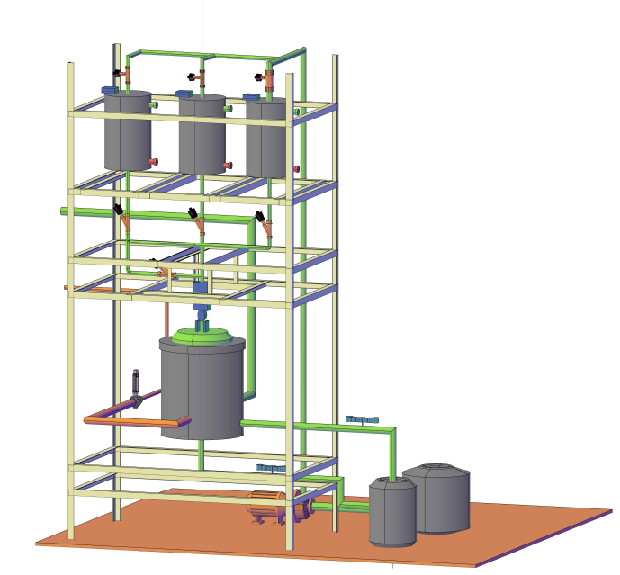
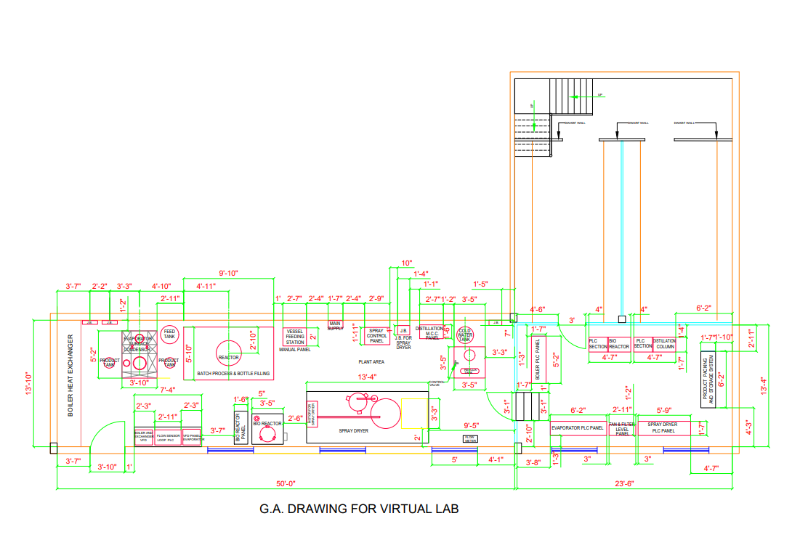

 ##### Introduction to GA Drawing and Mimic Diagram of a control panel
A General Arrangement (GA) drawing is a detailed drawing that shows the layout and arrangement of components, instruments, and equipment on a control panel. It is an essential document used in the design, construction, and operation of industrial control systems. A mimic diagram, on the other hand, is a graphical representation of a plant's layout and process flows, displayed on a control panel or Human-Machine Interface (HMI). It provides a visual representation of the plant's operation, allowing operators to quickly identify and respond to process changes and alarms.

###### Creation of GA Drawing and Mimic Diagram
The creation of a GA drawing and mimic diagram involves a thorough understanding of the plant's layout, process flows, and control system architecture. The design process typically begins with a review of the plant's Piping and Instrumentation  Diagrams (P&IDs), process flow diagrams, and control system documentation. The designer then uses specialized software,
such as Computer-Aided Design (CAD) or HMI development tools, to create the GA drawing and mimic diagram. The drawing and diagram must be designed in accordance with international standards and best practices, ensuring clarity, consistency, and accuracy.

###### Standards and Best Practices
The development of GA drawings and mimic diagrams must adhere to international standards and best practices. The International Electrotechnical Commission (IEC) and the International Society of Automation (ISA) provide guidelines and standards for the design of control panels and HMIs. Additionally, industry-specific standards, such as those for the oil and gas or power generation industries, may also apply. Globally, standard practices include the use of standardized symbols, colors, and notation systems, as well as the consideration of human factors, ergonomics, and operator usability.

###### Care During Design
When designing GA drawings and mimic diagrams, care must be taken to ensure accuracy, clarity, and consistency. The designer must consider the operator's perspective, ensuring that the diagram is easy to understand and navigate. The use of standardized symbols, colors, and notation systems is essential to avoid confusion and misinterpretation. Additionally, the designer must ensure that the diagram is scalable, allowing for easy expansion or modification as the plant's layout and process flows change. Finally, the designer must verify the accuracy of the drawing and diagram through thorough testing and validation, ensuring that they accurately represent the plant's operation.

